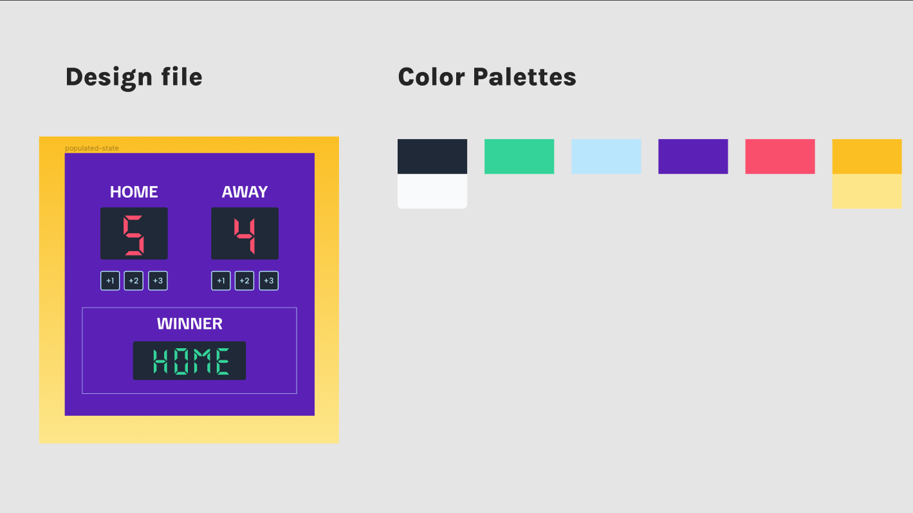
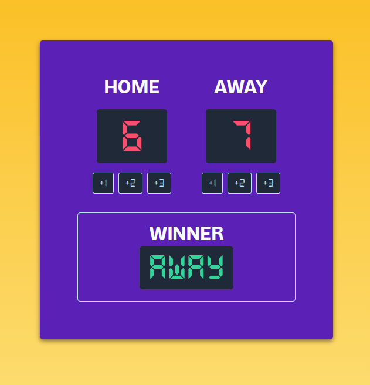

# Scoreboard

<kbd>HTML</kbd> &middot; <kbd>CSS</kbd> &middot; <kbd>JS</kbd>

## Learning Objectives

1. Create design using Figma
1. Convert Fimga design into HTML page
1. Use JavaScript for functionality and display.

### Figma Design

See [figma design](https://www.figma.com/design/MMVuSxf0jZAf6BtX6bCsTP/Basketball-Scoreboard?node-id=129%3A14&t=3qHWkTMu2Q36buUq-1).

### Site Design

Site designed using HTML, CSS and vanilla JS. See screenshot:

Learn more from courses 🚀
- [Our courses](https://scrimba.com/allcourses)
- [The Frontend Career Path](https://scrimba.com/learn/frontend)
- [Become a Scrimba Pro member](https://scrimba.com/pricing)

